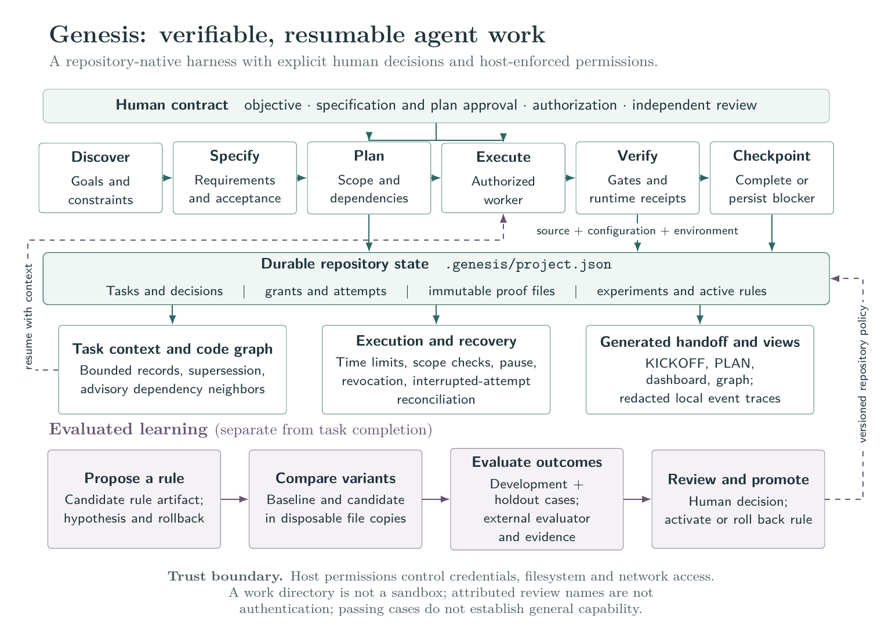
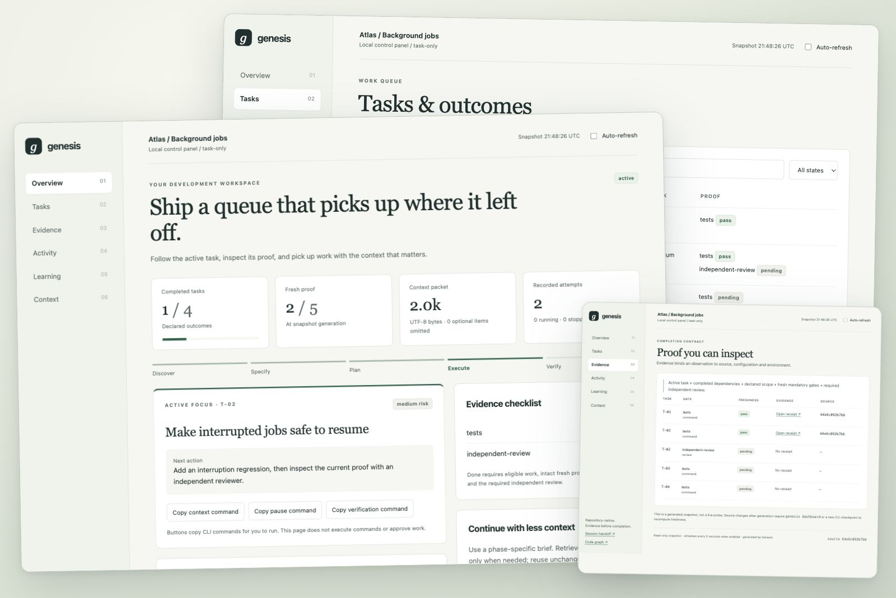

<div align="center">

# Genesis

### A repository-native harness for verifiable, resumable agent work

[](https://github.com/ayush488-glitch/genesis-kit/actions/workflows/test.yml)
[](https://nodejs.org/)
[](package.json)
[](LICENSE)

[Quick start](#quick-start) · [Architecture](#architecture) · [Completion contract](#completion-contract) · [Experiments](#evaluated-learning) · [Documentation](#documentation)

</div>

## Abstract

Long-running coding work needs more than a conversation history: it needs a durable account of the intended outcome, authorized actions, observed evidence, and unfinished work. **Genesis** stores that account inside the repository and exposes it through a small, agent-agnostic CLI. It connects specification, task execution, proof, recovery, and evaluated learning while preserving explicit human decisions.

Genesis runs locally on **Node.js 18+ with no npm dependencies**. Coding hosts supply the model and execution permissions. The repository supplies its acceptance checks. Genesis coordinates their state and rejects completion when the required evidence is missing, altered, stale, or inconsistent with the current task.

> **Research status.** The implementation includes executable regression tests and a baseline/candidate evaluation path. It does not claim a benchmark improvement, general autonomous reliability, or security isolation from a working directory.

## Architecture

<p align="center">
  
</p>

<p align="center"><em>Figure 1. The development lifecycle and evaluated-learning loop share durable state; task completion and rule promotion have separate evidence requirements.</em><br>
<a href="docs/assets/genesis-architecture.tex">LaTeX / TikZ source</a> · <a href="docs/assets/genesis-architecture.pdf">Vector PDF</a> · <a href="docs/assets/README.md">Reproduce the figure</a></p>

| Layer | Responsibility | Durable output |
| :--- | :--- | :--- |
| Specification and planning | Capture goals, acceptance criteria, scope, dependencies and human approval | `SPEC.md`, requirement-linked tasks and approval records |
| Execution | Invoke one authorized host command under time and task limits | Attempt IDs, process identity, outcomes and stop reasons |
| Verification | Bind executable checks and independent review to current inputs | Immutable evidence files and runtime receipts |
| Continuation | Select relevant context and reconcile interrupted work | Checkpoints, blockers, scoped records, scope cards and a symptom map |
| Learning | Compare baseline/candidate behavior before adopting a rule | Experiment evidence, review, promotion and rollback records |

The canonical record is `.genesis/project.json`. `KICKOFF.md`, `PLAN.md`, the dashboard and code graph are generated views. Raw redacted event traces stay in the ignored `.genesis/local/` directory.

### Language coverage

The indexer is static, dependency-free and deliberately conservative about what it claims.

| Language | Files and imports | Symbols | Calls and inheritance |
| :--- | :--- | :--- | :--- |
| JavaScript, TypeScript, JSX, TSX | Yes, including `tsconfig` path aliases and pnpm/npm/yarn workspace packages | Yes, top-level declarations | Yes |
| Python | Yes | Yes, via the standard-library AST | Yes |
| Everything else | No | No | No |

A Go, Rust, Java or Ruby project will index as an almost empty graph. That is a limit of the
current extractors, not a configuration problem.

Two further limits worth stating. JavaScript and TypeScript symbols are found by an anchored
line scan, so a declaration must begin its own line; `import x from 'y'; export function z() {}`
on one line yields no `z`. Formatted source is unaffected, generated or minified files are not.
And a call whose target cannot be resolved to exactly one definition is either kept as an
`ambiguous` edge carrying every candidate, or counted and discarded. It is never guessed.

## Local control panel

Two panels ship. The generated HTML file is a static snapshot; `genesis serve` is a live view of
the index.

```sh
genesis serve . --open        # live: watches sources, reindexes on save, streams updates
genesis dashboard . --open    # static snapshot file, no server
npm run demo -- --open        # isolated synthetic project from a kit checkout
```

`genesis serve` runs a loopback-only, **read-only** server. It never writes state and never runs
commands, so approvals and gates stay in the CLI where the audit trail is. It also stays outside
the repository write lock, because holding that lock for a browsing session would block every
other command.

The centre view is a squarified treemap of the repository: directories contain files, files
contain a cell per symbol, and calls are drawn as filaments across the map. A file's position on
screen is its position in the tree, so the picture is stable between runs. The legend toggles
call, candidate and inheritance edges independently; candidates are dashed, because a maybe
should not be drawn like a fact. Hovering a file isolates its call traffic; clicking inspects it.

Editing a source file reindexes incrementally and updates the open page with no reload and no
command. Extraction is cached per file on size and mtime, so unchanged files are never reopened,
while resolution always runs over the whole file set: adding one file can resolve an import
elsewhere or turn a proven call into an ambiguous one. On a 351k-line monorepo a cold index takes
about 3.3 seconds and a single-file edit about 0.9 seconds, and the incremental result is
byte-identical to `--full`. Pass `--no-watch` to disable source watching, or `graphizer --full` to
force a rebuild.

Live source watching needs recursive `fs.watch`, which is available on macOS and Windows on any
supported Node, and on Linux from Node 20.13. Where it is unavailable the server says so and the
panel still works; rerun `genesis index` after edits.



The static panel brings together the active next action, task search and state filters, evidence
receipts, execution/recovery history, learning proposals and context metrics. It works as a local
HTML file, preserves filters and navigation across refreshes, and adapts to narrow screens. Its
buttons **copy CLI commands**; they do not execute commands or approve work. Rerun
`genesis dashboard` after external source changes to recompute evidence freshness.

## Query the index

The index is not only drawn, it is asked. Every answer carries where it came from.

```sh
genesis query . search formatDate            # where does this name live
genesis query . defines src/api              # what does this scope declare
genesis query . callers "src/lib/utils.ts#cn"
genesis query . callees loadUser
genesis query . impact packages/db/src/index.ts   # what breaks if I change this
genesis query . scope src/api                # a directory: in and out, with counts
genesis query . neighbours src/api/users.ts --hops 2
genesis query . path src/app.ts src/lib/format.ts
genesis query . callers loadUser --json      # for scripts and agents
```

`impact` is the one to reach for before an edit: everything that transitively imports a file,
with hop distance. On a real monorepo one shared package answered 2,296 files, which is the
question a grep cannot answer. It traverses imports only, not calls or inheritance, so treat a
clean result as a lead rather than proof that nothing else is affected.

```
$ genesis query . callers "apps/frontend/src/lib/utils.ts#cn" --limit 3
IntegrationTile      function · proven   apps/frontend/src/components/api-integration/ApiIntegrationPagePreview.tsx:93
LoadingSpinner       variable · proven   apps/frontend/src/components/appLayout/loading.tsx:3
MenuItems            variable · proven   apps/frontend/src/components/appLayout/menuItems.tsx:68
```

`scope` accepts a directory; the symbol tools take a file or a symbol. A reference can be a node id, a file path, a bare symbol name, or `path#name`. When a bare name
matches several definitions Genesis says so and names them rather than choosing for you:

```
$ genesis query . callers cn
note: "cn" matches 4; using symbol:apps/comment-to-dm/src/lib/utils.ts#function:cn
```

With `--json`, an ambiguous reference is reported in the payload rather than only on stderr, one
entry per reference resolved, so a two-endpoint query like `path` says which end was a guess:

```json
{ "ambiguous": [ { "ref": "helper", "resolved": "symbol:src/util.ts#function:helper",
                   "also_matched": ["symbol:src/util.ts#function:helper", "symbol:src/other.ts#function:helper"] } ],
  "results": [] }
```

Call results carry the tier the index resolved them at: `proven` when one definition matched, or
`ambiguous` with the candidates that were not ruled out. An uncertain answer keeps looking
uncertain at the point of use.

## Expose the index to your agent

```sh
genesis mcp .        # JSON-RPC over stdio
```

The same questions become MCP tools: `search_symbols`, `get_definitions`, `get_scope`,
`get_callers`, `get_callees`, `get_impact`, `get_neighbours`, `trace_path`. Register it with any MCP host:

```json
{ "mcpServers": { "genesis-index": { "command": "genesis", "args": ["mcp", "/path/to/repo"] } } }
```

This is the difference between a map and a tool. Genesis used to push one context packet and hope
it had guessed right; an agent can now interrogate the index while it works, and ask again when
the first answer changes the question. The server is read-only by construction and holds no write
path to project state, so approvals and gates stay in the CLI where the audit trail is. It has no
authentication: any local process can reach a loopback port whatever its filesystem permissions,
so do not run it against a confidential repository on a shared host.

## Efficient context and reusable briefs

```sh
genesis brief .                         # Current-phase guide + bounded task context
genesis brief . --stage research        # research | plan | implement | verify | recover
genesis context . --stats               # Bytes, heuristic token estimate, omissions
genesis context . --id K-1              # Full record on demand
genesis context . --since FINGERPRINT   # Reuse only a full packet already received
```

The default packet is capped at 8,000 UTF-8 bytes. Optional knowledge is ranked and summarized, while applicable invariants and active rules remain intact. A required contract that cannot fit produces an explicit budget error. `--full --bytes 64000` requests full optional records when needed. The smaller kickoff points to the brief rather than asking agents to load the entire state file.

When an index exists, the packet also carries two things read from it:

- **Scope cards.** For each declared scope: what it declares, what it depends on, and what depends on it. A task that names `src/api` arrives knowing which files would break.
- **A symptom map.** File paths, quoted strings and identifiers in the task text are resolved against the index before the agent reads anything, weighted so a named file outranks a bare word that merely looks like a symbol. The agent starts at a declaration rather than at a search.

Both are marked `advisory`: static analysis is a hint, not an authority. Records are ordered by relevance band first and shared vocabulary only as a tie-break, so `included_because` keeps meaning what it says.

The original [phase guides](recipes/README.md) make research, planning, implementation, verification and recovery reusable across coding hosts. They give smaller models explicit inputs, outputs and checks; capability improvement still needs evaluation. See the [review, measurements and experiment roadmap](docs/control-room-review.md). `npm run benchmark:context` reproduces payload measurements without a model call.

## Quick start

Open your project in a coding agent with shell access. Replace the goal below, then copy the **entire prompt**. It covers installation, existing-project adoption, and new-project setup.

```text
Install and use Genesis for this repository.
My project goal is: "REPLACE THIS WITH WHAT I WANT TO BUILD."

1. Check for Git, Node.js 18+, and the `genesis` CLI. If Genesis is already
   installed, use that installation and inspect its help and installed skill.
   Do not overwrite an existing installation or unrelated local changes.

2. If Genesis is missing, install the official kit:
   - Clone https://github.com/ayush488-glitch/genesis-kit.git into
     ~/.local/share/genesis-kit if that directory is absent.
   - If it already contains the official repository, inspect its status and
     update with a fast-forward-only pull when clean. Preserve local changes.
   - Run bash ~/.local/share/genesis-kit/install.sh.
   - Verify with ~/.local/bin/genesis help. Use that absolute CLI path if
     ~/.local/bin is not on PATH; do not edit shell startup files.
   - If prerequisites are missing or the existing directory belongs to
     something else, explain the specific issue instead of replacing it.

3. Load the installed Genesis skill and the bundled official Ponytail skill
   at full. If this coding host cannot discover skills, read their SKILL.md
   files directly from the kit's skills/genesis and skills/ponytail folders.

4. Inspect this project. If it already has Genesis state, read
   .genesis/KICKOFF.md and run `genesis status .` and `genesis brief .`.
   Resume the existing workflow; do not initialize over it.
   If it has implementation code but no Genesis state, run `genesis adopt .`
   read-only, show the discovery report, and obtain approval for adoption
   before using `genesis adopt . --write --objective "<my actual goal>"`.
   If it is a new project, run
   `genesis init . --workflow new-product --objective "<my actual goal>"`.
   Use my actual goal above, not a placeholder.

5. Run `genesis agent connect . --write` to connect repository instructions.
   Report the current state, evidence, blocker and exact next action.

6. For a new product, clarify users, outcomes, constraints, non-goals,
   acceptance criteria and unresolved assumptions. Record durable decisions
   and knowledge through Genesis. Fill SPEC.md with FR-*, NFR-* and AC-*
   identifiers. Run `genesis spec check .`, then obtain my specification
   approval before implementation. Record only approval I actually gave.

7. Define bounded tasks linked to the approved requirements, with file scope,
   dependencies and mandatory executable gates. Run `genesis plan check .`
   and obtain my plan approval before activating implementation. Declare
   observable actor/scope/environment/duration scenarios for autonomous work.

8. Continue only authorized active work. Run current gates; obtain independent
   review for non-low-risk tasks. Use `genesis task complete`, never a state
   edit, to complete work. If I authorize a bounded host command, record a
   task-scoped, expiring grant and use `genesis run`. Reuse valid authorization
   and proof across sessions. Never invent a reviewer or approval.

9. After interruption, inspect attempts and uncertain side effects before
   recovery or retry. Record durable discoveries and checkpoint before stopping.
   Treat learned rules as proposals until evaluation, review and promotion pass.
```

The installer supports skill discovery in Codex and Claude Code. Other shell-capable hosts can read the same Markdown/JSON contract and invoke the CLI; see [agent adapters](AGENT-ADAPTERS.md). The installer copies Genesis and a pinned MIT-licensed [Ponytail](https://github.com/DietrichGebert/ponytail) skill and creates a CLI symlink. It does not download runtime dependencies or modify shell startup files.

<details>
<summary><strong>Manual installation and later-session prompt</strong></summary>

For a fresh installation on a Unix-like shell:

```bash
git clone https://github.com/ayush488-glitch/genesis-kit.git ~/.local/share/genesis-kit
bash ~/.local/share/genesis-kit/install.sh
~/.local/bin/genesis help
```

For a later coding session:

```text
Resume this repository with Genesis and Ponytail full. Read .genesis/KICKOFF.md,
run `genesis status .` and `genesis brief .`, and verify current source and proof.
Continue the active task within existing authorization. Reconcile interrupted
attempts before replaying commands. Persist decisions and checkpoint before stopping.
```

</details>

## Completion contract

For a task $t$, Genesis treats completion as a conjunction of checks:

$$
\mathrm{Done}(t) \Rightarrow
\mathrm{Active}(t) \land
\mathrm{DependenciesDone}(t) \land
\mathrm{ScopeValid}(t) \land
\bigwedge_{g\in G_t}\mathrm{FreshProof}(g) \land
\mathrm{RequiredReview}(t).
$$

Here $G_t$ is the set of mandatory gates, including at least one executable gate. Workflow approval is required for specification-first projects. Scope is enforced when declared and is required for autonomous execution. Independent human review is required above low risk.

Fresh executable proof binds the check to source inputs, task configuration and selected environment values. It retains command, attempt identity, timestamps, exit status and an integrity hash. A source-mutating check cannot certify its own result. New executable evidence invalidates review of an older attempt. Runtime gates additionally produce structured identity receipts with a freshness limit.

These are operational checks, not a mathematical proof of software correctness. Their strength depends on the acceptance tests and the authority protecting the verifier and its evidence.

## A minimal workflow

```bash
# Establish the product contract.
genesis init . --workflow new-product --objective "Build a scheduling tool"
genesis agent connect . --write
# Edit SPEC.md with real requirements and acceptance criteria.
genesis spec check .
# Record only actual human approval.
genesis spec approve . --human owner --reason "Reviewed scope and acceptance"

# Define a slice; substitute requirement IDs present in your specification.
genesis task add . --id T-1 --outcome "Staff can create an appointment" \
  --risk medium --scope src --scope tests \
  --requirement FR-1 --requirement NFR-1 --requirement AC-1 \
  --gate 'tests:npm test'
genesis plan check .
genesis plan approve . --human owner --reason "Reviewed tasks and proof"

# Implement the active task, then verify and obtain independent review.
genesis gate . T-1
genesis control approve . T-1 --gate independent-review \
  --human reviewer --reason "Checked the diff and current evidence"
genesis task complete . --id T-1
genesis checkpoint .
```

Existing repositories start with `genesis adopt .` for a read-only discovery report. After approval, `genesis adopt . --write` creates the harness without reorganizing source code. `genesis migrate .` inspects legacy state; add `--write` to migrate while preserving legacy files.

## Bounded autonomy and recovery

`genesis run` accepts an expiring authorization for one task and host command. Autonomous tasks must declare file scope and outcome scenarios. The runner invokes the command, checks scope, verifies gates and either completes the task or persists a stop condition. It reuses an unchanged successful worker after a review stop, avoiding an unnecessary replay of side effects.

| Command | Purpose |
| :--- | :--- |
| `genesis context . --bytes 8000` | Retrieve bounded task context, applicable rules and existing authorization |
| `genesis authorize grant . …` | Record a task-scoped command grant with explicit expiry |
| `genesis run . --max-tasks 1 --timeout 600000` | Execute within task and wall-clock limits |
| `genesis control pause . T-1` | Stop active work while preserving operator intent |
| `genesis recover .` | Reconcile dead attempts without replaying their commands |
| `genesis incident record . …` | Separate an observed symptom from its causal hypothesis |

See the [autonomy contract](docs/autonomy-contract.md) for complete authorization and scenario arguments, runtime receipt schemas, recovery behavior and upgrade requirements. Host permissions remain responsible for filesystem/network isolation and spending limits. Recovery cannot promise exactly-once effects in an external service.

## Evaluated learning

A proposed rule follows a separate lifecycle:

```text
hypothesis → candidate artifact → baseline/candidate evaluation
           → independent review → explicit promotion → rollback if needed
```

`genesis evaluate` runs development and holdout cases against separate disposable copies, using an evaluator outside both source trees. `genesis learn evaluate` binds the proposal to an exact candidate policy artifact. Review and promotion require distinct human attribution; active rules appear in repository context and can be rolled back.

A passing experiment means every candidate case passed without a baseline regression. A tie is allowed and **does not establish improvement**. Elapsed time and outcomes are retained; unknown cost stays unknown. For adversarial optimization, protect the evaluator and holdout with host-enforced isolation: directory separation alone cannot do that.

## Reproducibility and evaluation

```bash
npm test                         # No dependency installation required
node --check tools/genesis.mjs
bash -n install.sh
./make-zip.sh /tmp/genesis-kit.zip # Offline distribution
```

CI runs syntax checks and the suite on Node 18 and 22. An optional [development container](.devcontainer/devcontainer.json) provides the contributor runtime. The tests cover completion bypasses, missing/tampered evidence, source and environment drift, dependency readiness, runtime mismatch, worker reuse, pause/revocation, timeout, live-process recovery, context supersession and evaluated rule promotion. These are synthetic regression cases, not a representative coding benchmark; private session transcripts are not distributed.

For capability experiments, compare the same host and model with a fixed task set, matched budgets and an independently protected evaluator. Report paired completion outcomes, regressions, interventions, recovery behavior, elapsed time and actual cost. Preserve failed runs and use held-out tasks after candidate selection.

The [architecture figure](docs/assets/README.md) is reproducible from committed LaTeX/TikZ source. Building documentation assets requires Tectonic and Poppler; running Genesis does not.

## Related work

Useful reference points include [SWE-agent](https://github.com/SWE-agent/SWE-agent) for agent-computer interfaces in software engineering, [OpenHands](https://github.com/OpenHands/OpenHands) for software-agent infrastructure, [Spec Kit](https://github.com/github/spec-kit) for specification-driven development, and [DSPy](https://github.com/stanfordnlp/dspy) for programming and optimizing language-model systems. These are related projects, not required dependencies or evidence of Genesis outperforming them.

## Documentation

| Document | Contents |
| :--- | :--- |
| [Autonomy contract](docs/autonomy-contract.md) | Commands, evidence, runtime receipts, learning, limitations and 2.1 migration |
| [Workflow plan](docs/workflow-plan.md) | Specification-first workflow and phase boundaries |
| [Architecture decisions](docs/decisions.md) | Repository structure and design rationale |
| [Agent adapters](AGENT-ADAPTERS.md) | Host integration and shared repository contract |
| [Figure source and build](docs/assets/README.md) | Reproducible architecture diagram |

## Contributing

Start with [CONTRIBUTING.md](CONTRIBUTING.md), the [development and release guide](docs/development.md), and [changelog](CHANGELOG.md). Open an issue with a reproducible failure or a bounded proposal. For behavior changes, include the triggering scenario, expected outcome and a regression test. Keep changes small, preserve existing repository state, and run `npm test` before opening a pull request. Claims about autonomy or learning should include the evaluation setup and observed results.

A manually triggered workflow tests and packages a **draft release** with a ZIP and SHA-256 checksum. Maintainers inspect it before publication; see [the release process](docs/development.md#release-process).

## License

Genesis is [MIT-licensed](LICENSE). The bundled Ponytail skill retains its upstream MIT license and attribution in [its source](skills/ponytail/SKILL.md).
